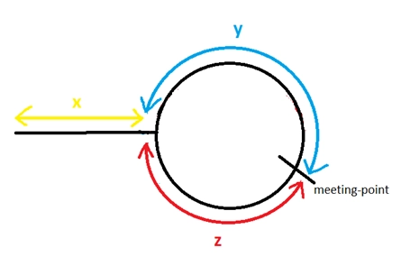

https://medium.com/@arifimran5/fast-and-slow-pointer-pattern-in-linked-list-43647869ac99
https://codeburst.io/fast-and-slow-pointer-floyds-cycle-detection-algorithm-9c7a8693f491
https://www.naukri.com/code360/library/floyds-cycle-finding-algorithm
https://www.educative.io/answers/why-does-floyds-cycle-detection-algorithm-work

The idea is to keep two pointers fast and slow. fast will move at different speed than slow based on the requirements.
Why do we do this?
Bcz in LL, we don't know the bounds and size. We only get the head reference. It may have cycles, it may have n nodes.
So in this DS, we apply this approach to get to the node we look for, detect cycles etc.,

1) Finding middle node

slow and fast starts at head and moves together
slow moves 1x (slow = slow.next)
fast moves 2x (fast = fast.next.next)

Odd: 1 2 3 4 5
slow=1 fast=1
slow=2 fast=3
slow=3 fast=5, when fast is at the tail (fast.next is null), slow is at the middle

Even: 1 2 3 4 5 6
slow=1 fast=1
slow=2 fast=3
slow=3 fast=5
slow=4 fast=null, when fast is at the null (fast is null), slow is at the middle (right side)
If we need left middle, we need to check for fast.next.next != null

2) Finding nth node

Gap between slow and fast to be n-1.
Move fast to the nth node from left.
Then move slow from head and fast from nth together 1 by 1 till fast.next is null (fast is at the tail)

Case: 1 middle node
1 2 3 4 5 6 7 8 9 and n=7
fast=7
slow=1 fast=7
slow=2 fast=8
slow=3 fast=9, fast is at the tail, slow is at the 7th node from right

Case 2: Head node
1 2 3 4 5 6 7 8 9 and n=9
fast=9
fast.next is null, meaning we're looking for head node

Case 3: Tail node
1 2 3 4 5 6 7 8 9 and n=1
fast=1
slow=1 fast=1
slow=2 fast=2
slow=3 fast=3
slow=4 fast=4
slow=5 fast=5
slow=6 fast=6
slow=7 fast=7
slow=8 fast=8
slow=9 fast=9, fast is at the tail, slow is at the 1st node from right

3) Removing nth node

Same as 'Finding nth node', but we need to be at n-1 th node, to remove n easily.

So just follow 'Finding nth node' to find n-1 th node and then remove n by setting n-1.next = n-1.next.next

Case 1: middle node
1 2 3 4 5 6 7 8 9 and n=7
fast=8
slow=1 fast=8
slow=2 fast=9, fast is at the tail, slow is at the n-1 th node from right
n-1.next = n-1.next.next

Case 2: Head node
1 2 3 4 5 6 7 8 9 and n=9
fast=10
fast is null, meaning we're looking for head node
return head.next

Case 3: Tail node
1 2 3 4 5 6 7 8 9 and n=1
fast=2
slow=1 fast=2
slow=2 fast=3
slow=3 fast=4
slow=4 fast=5
slow=5 fast=6
slow=6 fast=7
slow=7 fast=8
slow=8 fast=9, fast is at the tail, slow is at the n-1 th node from right

n-1.next = n-1.next.next

4) Detecting cycles or loops in LL (Tortoise & Hare / Floyd's Cycle Detection Algorithm)

Tortoise & Hare is a specific application of the slow/fast pointer strategy.
The slow/fast technique is more general, used across a wider variety of problems.

slow and fast pointer starts at head and moves together.
slow moves at 1x and fast moves at 2x.
When loop exists, slow and fast meet at same node (maybe in 1st iteration, or k iterations).
When loop doesn't exist, fast will reach tail sooner than slow and exits iteration.

1 2 3 4 5 6 2 3 ...
s=1 f=1
s=2 f=3 distance=4
s=3 f=5 distance=3
s=4 f=2 distance=2
s=5 f=4 distance=1
s=6 f=6 distance=0 --> met, so loop exists

1 2 3 4 5 6
s=1 f=1
s=2 f=3
s=3 f=5
s=4 f=null -> f ended, so no loop exists

5) Find start of cycle

Detect loop exists using 'Floyd's Cycle Detection Algorithm'

s=1 f=1
s=2 f=3 distance=4
s=3 f=5 distance=3
s=4 f=2 distance=2
s=5 f=4 distance=1
s=6 f=6 distance=0 --> met, so loop exists

s has travelled x + y to meet y
f has travelled to x + y + z + y to meet y

In a given time, s travelled at 1x speed and covered x+y
f travelled at 2x speed and covered x+2y+z

So, dhare = 2dtortoise

x + 2y + z = 2 (x+y)
x + 2y + x = 2x + 2y
x = z

So, if one travels from head and the other travels from meeting point, when both meets at some point, that's the start
of cycle.

6) Remove cycle in LL

Case 1: Cycle starts at the head (head & meeting point are same)
Case 2: Cycle starts at anywhere else

Detect cycle (find meeting point). Also keep track of previousNode while detecting loop for case 1. For case 2, we can
find prev node while finding start of cycle.

Ex 1: 1 2 3 4 5 6 1 2 ...
s=1 f=1
s=2 f=3
s=3 f=5
s=4 f=1
s=5 f=3
s=6 f=5
s=1 f=1 -> meeting point

head and f are same, so just set 6.next = null

Ex 2: 1 2 3 4 5 6 6 6 ....
s=1 f=1
s=2 f=3
s=3 f=5
s=4 f=1
s=5 f=3
s=6 f=5
s=6 f=6 -> meeting point

Find start
prev=6 s=1 f=6
prev=6 s=2 f=6
prev=6 s=3 f=6
prev=6 s=4 f=6
prev=6 s=5 f=6 -> 6.next is the starting point
f.next=null

Ex 3: 1 2 3 4 5 6 3 4 5 6 ...
s=1 f=1
s=2 f=3
s=3 f=5
s=4 f=3
s=5 f=5 -> meeting point

Find start
s=1 f=5
s=2 f=6 -> f.next is the starting point. f.next=null
