Self-balancing BST

AVL tree is binary search tree with additional property that difference between height of left sub-tree and right 
sub-tree of any node can’t be more than 1. 

### Key

- Height starts from 0
- Height of tree with only one node is 0
- If there are n nodes in AVL tree, minimum height of AVL tree is floor(log2n).
- If there are n nodes in AVL tree, maximum height can’t exceed 1.44 x log2n.
- If height of AVL tree is h, maximum number of nodes can be 2h+1 – 1.
- Minimum number of nodes in a tree with height h can be represented as:
N(h) = N(h-1) + N(h-2) + 1 for n>2 where N(0) = 1 and N(1) = 2.
- The complexity of searching, inserting and deletion in AVL tree is O(log n).

### Definitions

#### Height of the node
Length of longest path from that node to any of the leaves

#### The Balance Factor
A node's balance factor is the difference in subtree heights.

The subtree heights are stored at each node for all nodes in an AVL Tree, and the balance factor is calculated based on its subtree heights to check if the tree has become out of balance.

The height of a subtree is the number of edges between the root node of the subtree and the leaf node farthest down in that subtree.
 
BFx = height(rightSubtree(x)) - height(leftSubtree(x)), where x is the node

BFx should be 0, 1 or -1 at any point in time, otherwise tree needs to be balanced

### Insertion
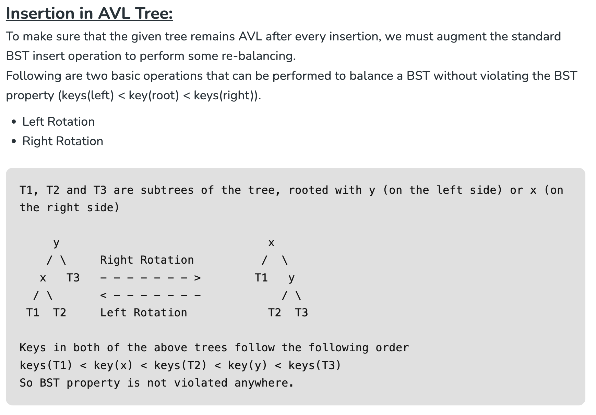
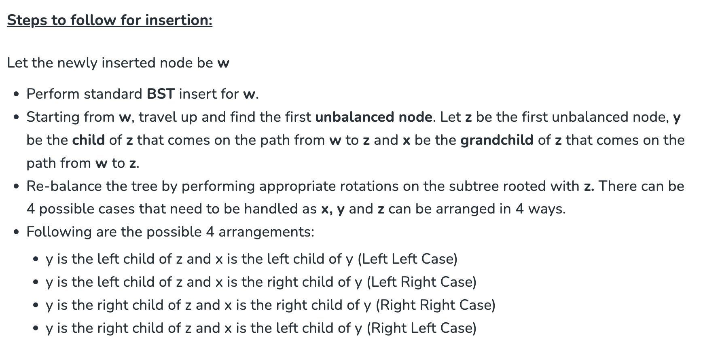
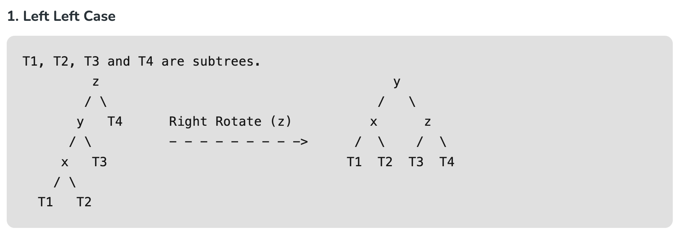
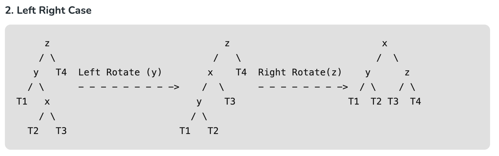
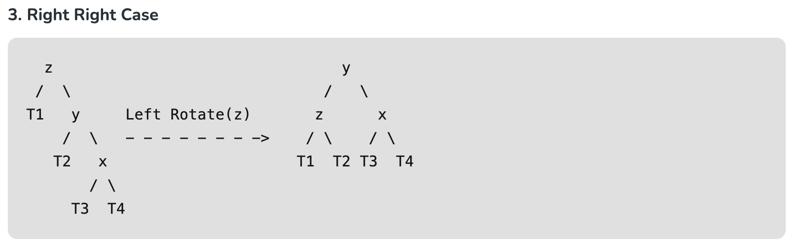
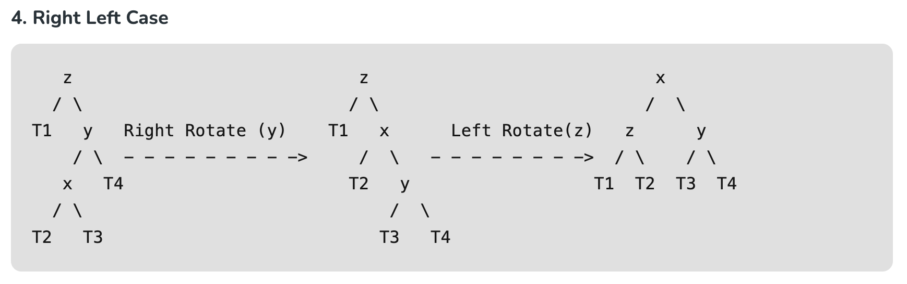

#### Examples
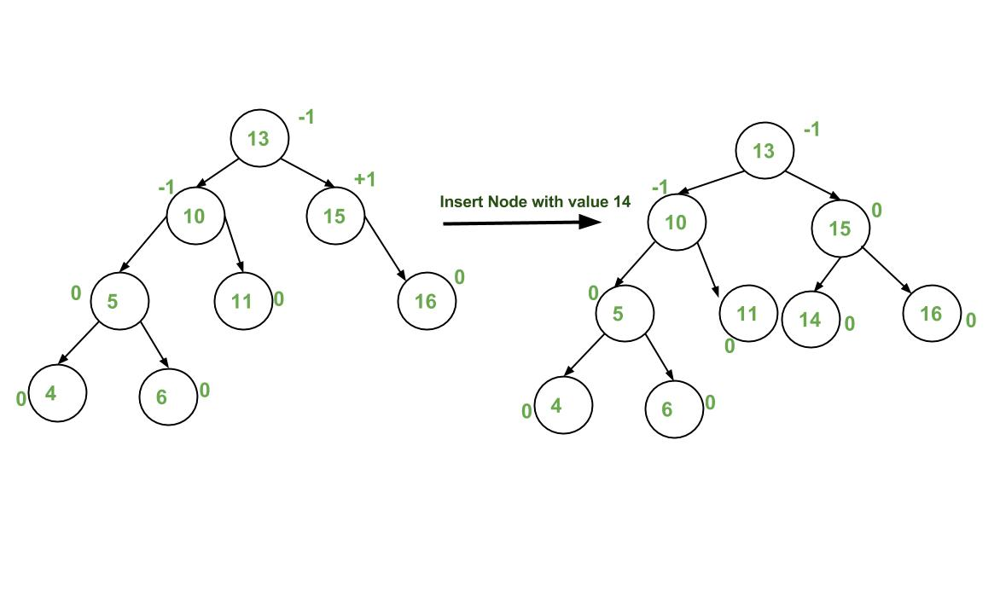
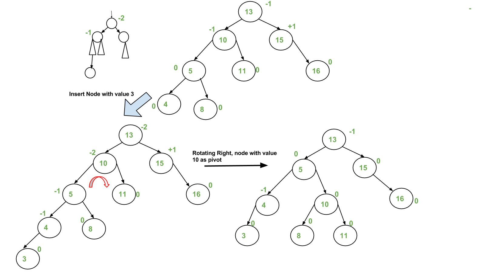
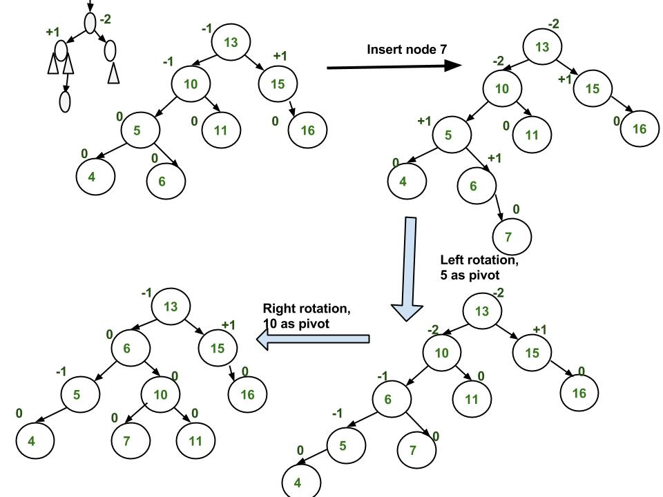
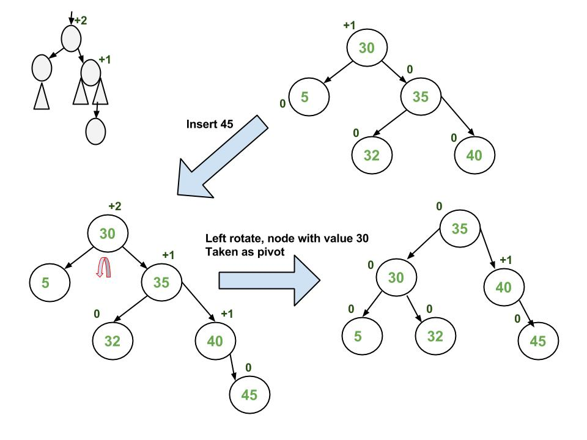
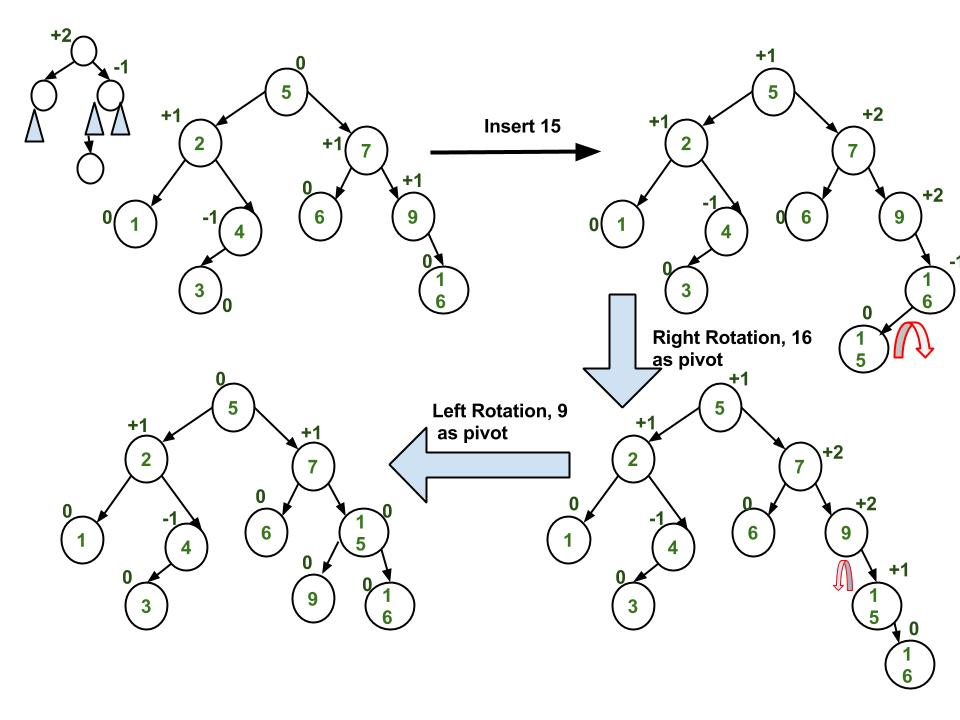

### Deletion
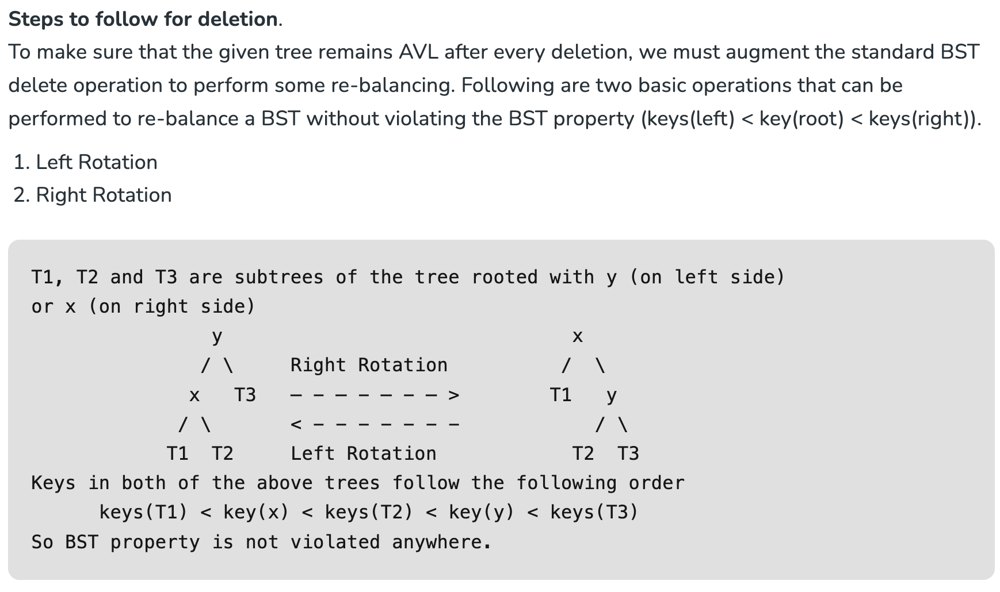
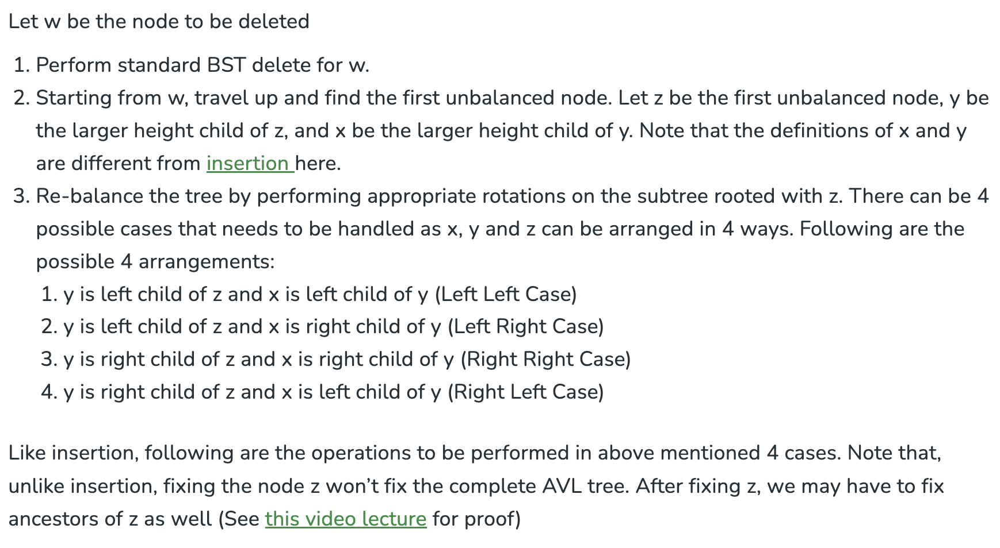
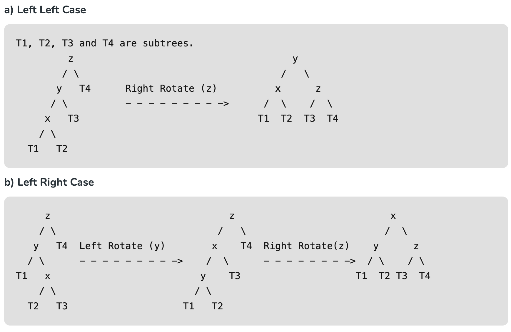
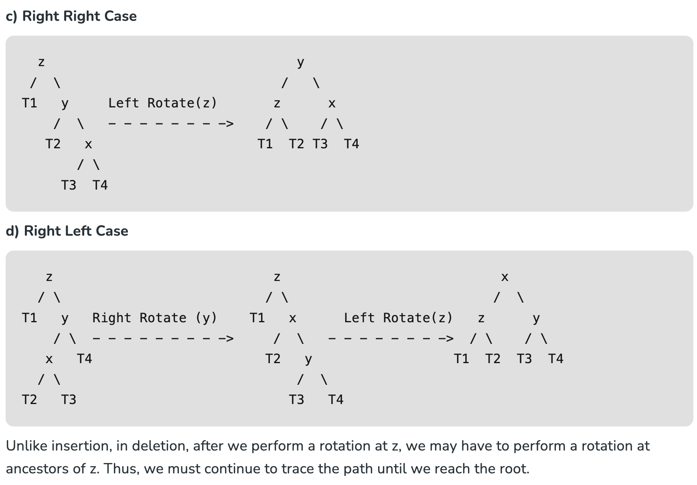
