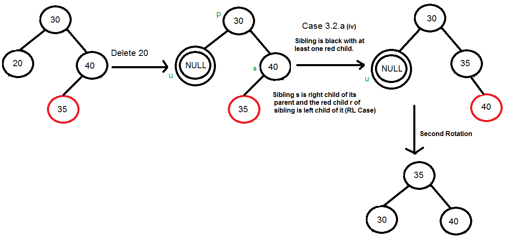

### Need

When it comes to searching and sorting data, one of the most fundamental data structures is the binary search tree.
However, the performance of a binary search tree is highly dependent on its shape, and in the worst case, it can
degenerate into a linear structure with a time complexity of O(n). This is where Red Black Trees come in, they are a
type of balanced binary search tree that use a specific set of rules to ensure that the tree is always balanced. This
balance guarantees that the time complexity for operations such as insertion, deletion, and searching is always O(log
n), regardless of the initial shape of the tree.

Red Black Trees are self-balancing, meaning that the tree adjusts itself automatically after each insertion or deletion
operation. It uses a simple but powerful mechanism to maintain balance, by coloring each node in the tree either red or
black.

### Definition

Red-Black tree is a binary search tree in which every node is colored with either red or black. It is a type of self
balancing binary search tree. It has a good efficient worst case running time complexity.

### Properties

The Red-Black tree satisfies all the properties of binary search tree in addition to that it satisfies following
additional properties –

1. Root property: The root is black.
2. External property: Every leaf (Leaf is a NULL child of a node) is black in Red-Black tree.
3. Internal property: The children of a red node are black. Hence possible parent of red node is a black node.
4. Depth property: All the leaves have the same black depth.
5. Path property: Every simple path from root to descendant leaf node contains same number of black nodes.

The result of all these above-mentioned properties is that the Red-Black tree is roughly balanced.

Rules That Every Red-Black Tree Follows:

1. Color: Every node has a color either red or black.
2. Black: The root of the tree is always black & Every leaf (e.i. NULL node) must be colored BLACK.
3. Red: There are no two adjacent red nodes (A red node cannot have a red parent or red child).
4. Black Height: Every path from a node (including root) to any of its descendants NULL nodes has the same number of
   black nodes.

### Insertion

1) Root is red
2) Node's parent is red and uncle is also red - Recolor aunt and parent to black & grandparent to red
3) Node's parent is red and uncle is black -> Rotate for 1 of the cases and recolor parent to black & grandparent to red
   a) Left-Left
   b) Left-Right
   c) Right-Right
   d) Right-Left

### Deletion

Let,
the node to be deleted - v
child of the node to be deleted - u
other child of the parent, sibling to v - s
red child of the sibling s - r

1) Either u or v is red -> Just delete node and set parent color to black (Both cannot be red, as it
   violated RBT rule)
    - Mark replaced child as black, hence no change in black height
2) Both u & v are black
    1) s is black
        1) at least one of its child is red (r)
            1) Left-Left case --> s is left child of its parent & r is left child of s (or both child of s are red)
            2) Left-Right case --> s is left child of its parent & r is right child of s
            3) Right-Right case --> s is right child of its parent & r is right child of s (or both child of s are red)
               
            4) Right-Left case --> s is right child of its parent & r is left child of s
               
        2) both children of s are black
           
    2) s is red
        1) s is left child of its parent
        2) s is right child of its parent
           
3) If u is root
   - make it single black and return (Black height of complete tree reduces by 1)