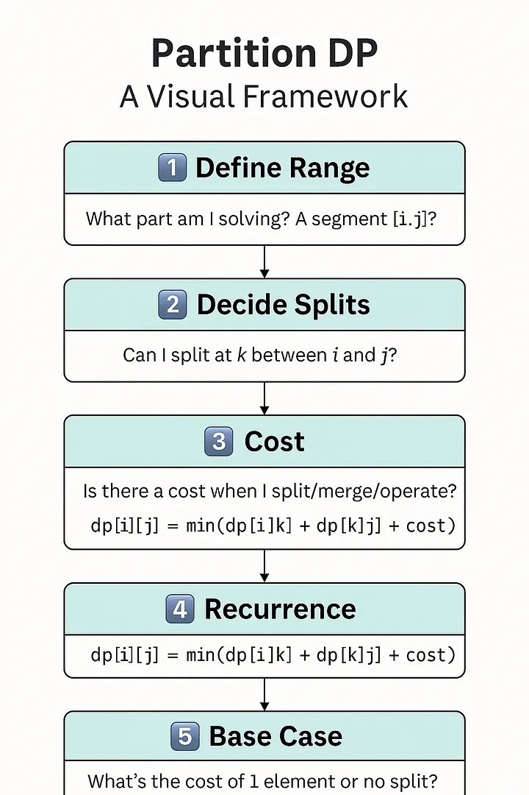

Partition DP
If a problem can be split into several partitions at each iteration, then it's a partition DP problem.

- Normal DP subproblem will require a constant number of sub-problems to be solved for each iteration (1 or 2 or 3 or k)
- Whereas Partition DP requires to solve n number of sub-problems

How to identify?
Look for a smallest sub-problem.
If that itself needs has n different solutions, then it's a Partition DP

1) Matrix Chain Multiplication
   Smallest subproblem is 2 matrix. But there can be several 2 matrix combination
   If we choose one, the other subproblem will have different cost
   Choose a partition whose left and right partition low cost
2) Minimum cost to cut stick
   Smallest subproblem is any cut. Bcz all cut has same cost.
   Choose a cut whose left and right subproblem combined has less cost
3) Burst Balloons
   First balloon to burst will need some additional state to be maintained.
   Last balloon to burst approach will not need it, we can play with index.
   Smallest subproblem is any balloon as all will cost the same.
   But their subproblems (left and right) will cost more or less.
   Choose the balloon whose subproblems also cost max
4) Palindrome Partitioning (Front partition)
   Smallest subproblem can be any single char as they're all palindromes
   But number of partitions for remaining will be less or more.
   So choose a partition whose subproblems' partition are also less
5) Evaluate boolean expression
   Smallest subproblem is solving any expression which has BxB.
   But the remaining sub-problems may have less or more.
   So choose a partition, whose subproblems also has higher result
6) Partition Array for Max Sum
   Similar to Palindrome Partitioning

---

# DP on Partitions

Partition DP is that friend who:

> Can’t make a decision without “considering all possible options”

> Makes 100 spreadsheets before buying socks

> Doesn’t just break up once — splits every conversation into two to find the optimal emotional damage 😜

Pre-requisites : Have solved Dynamic programming problems before — 1D Dynamic programming, DP on subsets and so on. This
could go overhead if you haven't previously solved other dynamic programming questions.

When you’re just getting comfortable with dynamic programming, many problems follow a familiar pattern: define a state,
build it up using smaller subproblems, and cache results for reuse.

But some DP problems don’t just progress linearly — they ask you to try every possible place to split the input and
choose the best one. That’s where Partition DP shines.

## 🤔 What is Partition DP?

Partition DP is a technique where we solve a problem by dividing it into multiple partitions (or segments), solving each
subproblem individually, and then combining their results optimally.

It’s commonly used when:

You can divide the input (array, string, etc.) into two or more pieces
The final result depends on the results of those pieces plus the cost of combining them

## 📦 Classic Problems that Use Partition DP

Here are a few well-known examples:

Matrix Chain Multiplication
Burst Balloons
Palindrome Partitioning
Minimum Cost to Cut a Stick
Egg Dropping ProblemFloors vs eggs

## 🧠 The Common Structure

1) Define the problem by a range — use indices , conventionally i and j to define the problem. This represents the
   partition under consideration
2) For each partition, try out all possible ways to divide it — k possible sub partitions in the range of i , j; When
   you do a partition, it comes with a cost — the cost of making that choice — COST(i,j)
3) And when we make a partition at k, we get two sub-partitions: ( i, k) and (k, j). We further explore those
   sub-partitions.